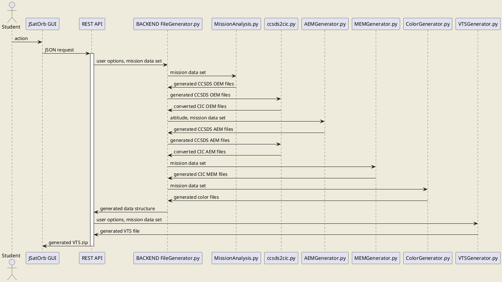

# JSatOrb project: JSatOrb common: VTS sub-module

This module generates OEM, AEM, and MEM files for satellites orbiting any central body, and a VTS file per mission to configurate VTS visualization.


## FileGenerator

The `FileGenerator.py` class generates OEM, AEM, and MEM files by respectively calling [this function](../../../jsatorb-visibility-service/src/MissionAnalysis.py), [this function](../AEM/AEMGenerator.py), and [this function](../MEM/MEMGenerator.py).
The documentations for these functions can be found [here](../../../jsatorb-visibility-service/README.md), [here](../AEM/README.md), and [here](../MEM/README.md).
It also generates a color file, which can be found [here](../MEM/ColorGenerator.py).
Since VTS requires CIC files and position, velocity, and attitude in an inertial frame whose axes are the EME2000 axes, this class also calls `ccsds2cic.py`, [here](../file-conversion/ccsds2cic.py).
However, for non-Earth central bodies, satellite coordinates have to be given in the inertial frame associated with the central body in Orekit (see [here](../MEM/README.md) for more details). In order to convert coordinates in the EME2000-axes frame to the Orekit inertial frame, the function `conversionEMEBody.py` can be used, and is [here](conversionEMEBody.py) with an example at the end of the file.

The starting date is the one given in the JSON header or in the GUI. If there are TLEs among the satellites, the starting date is the latest TLE date.

## VTSGenerator

The `VTSGenerator.py` class generates the VTS configuration file (.vts), using different .vts models.


## Prerequisites

- Python3.7
- A specific Python environment (named JSatOrbEnv) containing the following packages (installed through the conda-forge channel):
        - Orekit 10.2 (embedding hipparchus),
        - jinja2,
        - and bottle.


## Launch the service

This module is accessible through the JSatOrb centralized REST API which can be launched through the following commands:

Go into the REST API folder
```
cd jsatorb-rest-api
```
Activate the conda/python environment
```
conda activate JSatOrbEnv
```
Run the REST API
```
python src/JSatOrbREST.py
```
By default the service is running on the **port 8000**.


## VTS Generation Request Example

Route : '/vts', POST method
```json
{
  "header": {
    "mission": "test-VTS",
    "celestialBody": "EARTH",
    "timeStart": "2011-12-01T16:43:45",
    "timeEnd": "2011-12-02T16:43:45",
    "step": "10"
  },
  "satellites": [
    {"name": "KepSat",
    "type": "keplerian",
    "sma": 7000000,
    "ecc": 0.007,
    "inc": 51,
    "pa": 0,
    "raan": 0,
    "meanAnomaly": 0
    }
  ],
  "groundStations": [
    {"name": "sydney",
    "latitude": -33.86,
    "longitude": 151.20,
    "altitude": 58,
    "elevation": 12
    }
  ],
  "options": {
    "CARTESIAN": {},
    "ATTITUDE": {"law": "LOF_LVLH"}
  }
}
```


## VTS Generation Response Example

The response is a zip with all generated files.

Other examples of requests can be found [in the fileGenerator REST test file](../../../jsatorb-rest-api/test-rest/fileGenerator-request.http).


## Module's sequence diagram



_Remarks:_
- JSatOrb client can be the Web GUI or a batch client.  
- The REST API is the centralized REST API which code is in the jsatorb-rest-api/JSatOrbREST.py Python module.  
- The back-end code is in the jsatorb-common/src folder, in the different subfolders.
