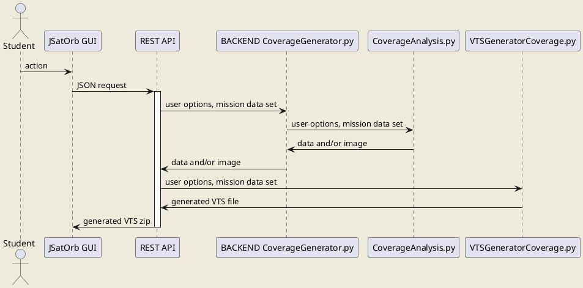

# JSatOrb Project: Coverage service

This module generates coverage .png maps for any number of satellites, for a given region of any central body. This module considers geodetic latitudes, meaning that the latitude is the angle between the normal and the equatorial plane.

For Keplerian and Cartesian satellites, the propagator is an analytical Keplerian propagator [(see the class documentation)](https://www.orekit.org/site-orekit-10.1/apidocs/org/orekit/bodies/CelestialBodyFactory.html).
For TLE satellites, the propagator is the Orekit propagator dedicated to TLEs [(see the class documentation)](https://www.orekit.org/site-orekit-10.1/apidocs/org/orekit/propagation/analytical/tle/TLEPropagator.html).

The starting date is the one given in the JSON header or in the GUI. If there are TLEs among the satellites, the starting date is the latest TLE date.

## List of Coverage services

- Percent coverage ("PERCENT_COV"): shows how much of the total time of the simulation a given point on the ground is covered.
- Time average gap ("TIME_AV_GAP"): average length of the gap we would find if we randomly sampled the system.
- Maximum gap ("MAX_GAP"): longest of the coverage gaps encountered for any individual point.
- Mean coverage gap ("MEAN_GAP"): average length of breaks in coverage for a given point.
- Mean response time ("MEAN_RESP_TIME"): average time from when we receive a random request to observe a point until we can observe it.


## Prerequisites

- Python3.7
- A specific Python environment (named JSatOrbEnv) containing the following packages (installed through the conda-forge channel):
        - Orekit 10.2 (embedding hipparchus),
        - jinja2,
        - and bottle.
- Numpy and Matplotlib (and dependencies). Works with Numpy 1.18.1 and Matplotlib 3.2.1, available on conda (`conda install numpy=1.18.1` and `conda install matplotlib=3.2.1`)


## Launch the service

This module is accessible through the JSatOrb centralized REST API which can be launched using the following commands:

Go into the REST API folder
```
cd jsatorb-rest-api
```
Activate the conda/python environment
```
conda activate JSatOrbEnv
```
Run the REST API
```
python src/JSatOrbREST.py
```
By default the service is running on **port 8000**.


# Run the tests

To run the tests, use the following command:  
```python test/Test[TEST_NAME].py``` where [TEST_NAME] is the name of the test to run or  
if you already ran the global tests script (`runAllTests.sh`) from the `jsatorb` module, you should have a `runTests.sh` script available in this module folder.

In this case, you can run it directly:  
```./runTests.sh```
This script will run all tests available in the test folder (all files satisfying the test/Test*.py pattern).


## Coverage Request Example

This request to the REST API contains a demand to the backend to process a Percent coverage visualization between a satellite (KepSat) and the Sydney location from the 1st to the 2nd of December 2011.  

Route : '/vts', POST method
```json
{
  "header": {
    "mission": "KepSat",
    "celestialBody": "EARTH",
    "timeStart": "2011-12-01T16:43:45",
    "timeEnd": "2011-12-02T16:43:45",
    "step": "10"
  },
  "satellites": [
    {"name": "KepSat",
    "type": "keplerian",
    "sma": 7000000,
    "ecc": 0.007014455530245822,
    "inc": 51,
    "pa": 0,
    "raan": 0,
    "meanAnomaly": 0
    }
  ],
  "constellations": [],
  "groundStations": [
    {"name": "sydney",
    "latitude": -33.8678500,
    "longitude": 151.2073200,
    "altitude": 58,
    "elevation": 12
    }
  ],
  "options": {
    "COVERAGE": {
      "timeStart": "2011-12-01T16:43:45",
      "timeEnd": "2011-12-02T16:43:45",
      "step": 60,
      "elevation": 0,
      "nbSatsToCover": 1,
      "regionLatitudes": [-90, 90],
      "regionLongitudes": [-180, 180],
      "plotType": "PERCENT_COV"
    },
    "CARTESIAN": {}
  }
}
```


## Coverage Response Example

The response returned by the REST API is a binary compressed data structure containing all the needed files to visualize the result in the VTS tool.

Other request examples can be found [here](../jsatorb-rest-api/test-rest/coverage-request.http).


## Module's sequence diagram



_Remarks:_
- JSatOrb client can be the Web GUI or a batch client.
- The REST API is the centralized REST API which code is in the jsatorb-rest-api/JSatOrbREST.py Python module.
- The back-end code is in the jsatorb-coverage-service/src Python folder for the coverage computation part, and in the jsatorb-common/VTS for the VTs file generation part.
