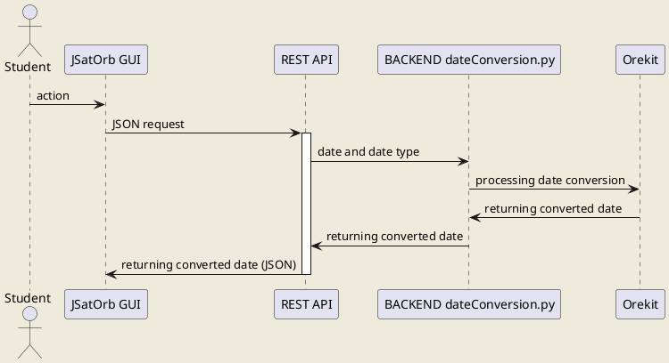

# JSatOrb project: Date conversion

This JSatOrb module uses Orekit to convert an ISO date into a Julian Day or a Modified Julian Day date.


## Prerequisites

- Python3.7
- A specific Python environment (named JSatOrbEnv) containing the following packages (installed through the conda-forge channel): 
	- Orekit 10.2 (embedding hipparchus), 
	- jinja2, 
	- and bottle.


## Launch the service

This module is accessible through the JSatOrb centralized REST API which can be launched using the following commands:

Go into the REST API folder
```
cd jsatorb-rest-api
```
Activate the conda/python environment
```
conda activate JSatOrbEnv
```
Run the REST API
```
python src/JSatOrbREST.py
```
By default the service is running on the **port 8000**.


# Run the tests

To run the tests, use the following command:  
```python test/Test[TEST_NAME].py``` where [TEST_NAME] is the name of the test to run or  
if you already ran the global tests script (`runAllTests.sh`) from the `jsatorb` module, you should have a `runTests.sh` script available in this module folder.

In this case, you can run it directly:  
```./runTests.sh```
This script will run all tests available in the test folder (all files satisfying the test/Test*.py pattern).


## Date Conversion Request Example

Route : '/dateconversion', POST method
```json
{
    "header": {
        "dateToConvert": "2020-04-07T16:53:16", 
        "targetFormat": "MJD"
    }
}
```

## Date Conversion Response Example

```json
{
  "status": "SUCCESS",
  "message": "",
  "data": {
    "dateConverted": "58946.70365740741"
  }
}
```

Some other examples can be found [in the date conversion REST test file](../jsatorb-rest-api/test-rest/dateConversion-request.http).


## Module's sequence diagram



_Remarks:_
- JSatOrb client can be the Web GUI or a batch client.
- The REST API is the centralized REST API which code is in the jsatorb-rest-apî/JSatOrbREST.py Python module.
- The back-end code is in the jsatorb-date-conversion/dateConversion.py Python module.